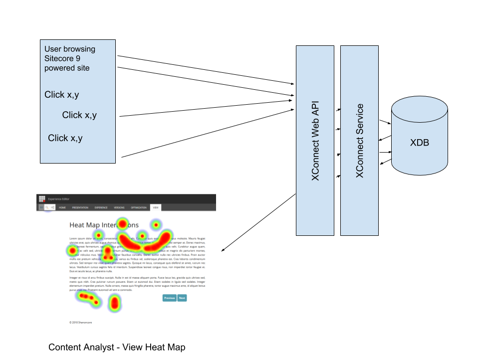

# Sitecore Hack-a-thon 2018
# Team Shanoncore

## Project Overview

Utilize the power of Sitecore 9 and XConnect/xDB to develop a heat mapping view of customer click interactions inside the Sitecore Experience Editor

Going forward this data could be utlized to perform A/B testing as well as providing personalized click tracking visualization for certain segment of Sitecore users, to understand how different user classifications are using the site.

- Sitecore 9.0 Update 1 Module (Module install package)
   - An installation Sitecore Package (`.zip` or `.update`)
   Peter or David (TBD)

## Module Documentation

- Precise and Clear Installation Instructions document (1 – 2 pages) (Peter or David)
  ### Module Purpose
  - To utilize XDB and XConnect to store and categorize user click data and display that data as a heatmap overlay on a page

  ### Module Sitecore Hackathon Category
  - XConnect

## Video Link
[Video Link](https://youtu.be/qhi2dAigZw0)